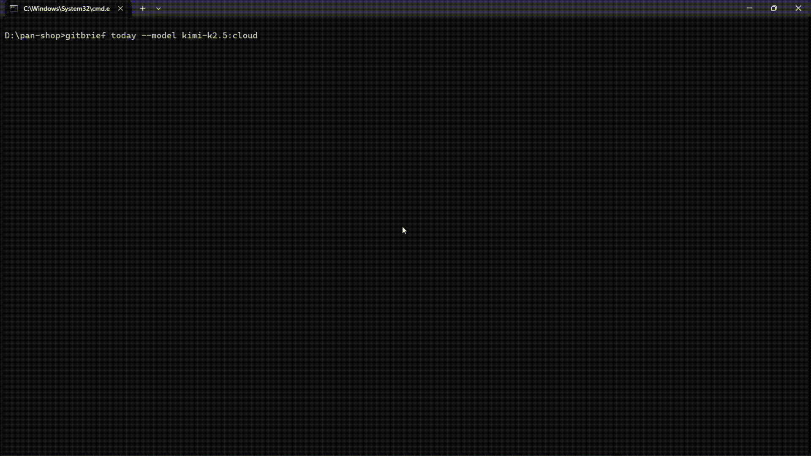

# commitpilot 🧠

[](https://pypi.org/project/commitpilot/)
[](https://python.org)
[](LICENSE)
[](https://github.com/Akshat190/commitpilot)

Your daily developer standup — powered by your Git history.

---

## ⚡ The Problem

Every day at standup:

“What did I actually do yesterday?”

You open Git, scroll commits, and still feel unsure.

---

## ⚡ Quick Demo



```bash
$ pip install commitpilot
$ commitpilot standup
**Yesterday:**
- Enhanced AI output quality
- Added deduplication and truncation

**Today:**
- Continue development

**Blockers:**
- None
```

**Your standup ready in seconds.**

---

## 🚀 Install

### From PyPI (recommended)
```bash
pip install commitpilot
```

### With OpenAI support
```bash
pip install commitpilot[openai]
```

### With Anthropic support
```bash
pip install commitpilot[anthropic]
```

### From source
```bash
pip install -e .
```

**Prerequisite:** [Ollama](https://ollama.ai) must be installed and running.

```bash
ollama serve
ollama pull llama3
```

---

## 🧪 Usage

```bash
# Today's summary (last 7 days)
commitpilot today

# Weekly summary (last 7 days)
commitpilot week

# Generate standup message (viral feature!)
commitpilot standup

# Diagnose issues
commitpilot doctor

# Commit statistics
commitpilot stats
commitpilot stats --days 30

# View past summaries
commitpilot history
commitpilot history --days 14

# Scan a specific repository
commitpilot today --path /path/to/repo

# Scan multiple repositories
commitpilot week --path /path/to/repos

# Filter by author
commitpilot today --author yourname

# Filter by branch
commitpilot today --branch main

# Custom date range
commitpilot today --since 2024-01-01 --until 2024-01-07

# Days to look back (default: 7)
commitpilot today --days-ago 14

# Limit commits processed
commitpilot today --max-commits 50

# Use different AI model
commitpilot today --model mistral

# Use OpenAI instead of Ollama
commitpilot today --provider openai --model gpt-3.5-turbo

# Use Anthropic
commitpilot today --provider anthropic --model claude-3-haiku-20240307

# Stream AI response (Ollama only)
commitpilot today --stream

# Export to markdown file
commitpilot today --export report.md

# Export as JSON for scripting
commitpilot today --json
commitpilot standup --json

# Show raw commits without AI
commitpilot today --no-ai
```

---

## ⚙️ Configuration

Create `~/.commitpilot.toml` to set defaults:

```toml
path = "/path/to/repos"
model = "llama3"
provider = "ollama"
timeout = 120
```

---

## 📁 Options

| Option | Alias | Description | Default |
|--------|-------|-------------|---------|
| `--path` | `-p` | Path to Git repo or directory | `.` |
| `--model` | `-m` | AI model to use | auto-detect |
| `--provider` | - | AI provider: `ollama`, `openai`, `anthropic` | `ollama` |
| `--days-ago` | - | Days to look back | `7` |
| `--max-commits` | - | Max commits to process | `100` |
| `--no-ai` | - | Skip AI, show raw commits | `false` |
| `--json` | `-j` | Output as JSON | `false` |
| `--stream` | - | Stream AI response (Ollama) | `false` |
| `--export` | `-e` | Export to file | - |
| `--since` | - | Start date (ISO format) | - |
| `--until` | - | End date (ISO format) | - |
| `--author` | - | Filter by author | - |
| `--branch` | `-b` | Filter by branch | - |

---

## 🗂️ Commands

| Command | Description |
|---------|-------------|
| `today` | Daily summary (last 7 days, for standups) |
| `week` | Weekly summary (last 7 days) |
| `standup` | Yesterday/Today/Blockers format |
| `stats` | Commit statistics |
| `history` | Past summaries |
| `doctor` | Diagnose issues & check setup |
| `version` | Show version |

---

## 🧠 Why this exists

Developers forget context. Git stores history but not understanding.

commitpilot turns commits into insights.

> "I built this because I kept forgetting what I worked on the day before. Now I just run `commitpilot` and know exactly what to continue working on."

---

## 🔧 Development

```bash
# Clone the repo
git clone https://github.com/Akshat190/commitpilot.git
cd commitpilot

# Install in development mode
pip install -e .

# Run tests
pytest

# Run linting
ruff check commitpilot/

# Run CLI
python -m commitpilot.cli today --path .
python -m commitpilot.cli stats
```

---

## 🤝 Contributing

PRs welcome! See [CONTRIBUTING.md](CONTRIBUTING.md) for details.

---

## 📝 License

MIT License - see [LICENSE](LICENSE)

---

## ⭐ Star this repo if it saved you time

[](https://github.com/Akshat190/commitpilot)

---

<p align="center">
Made with ❤️ for developers
</p>
